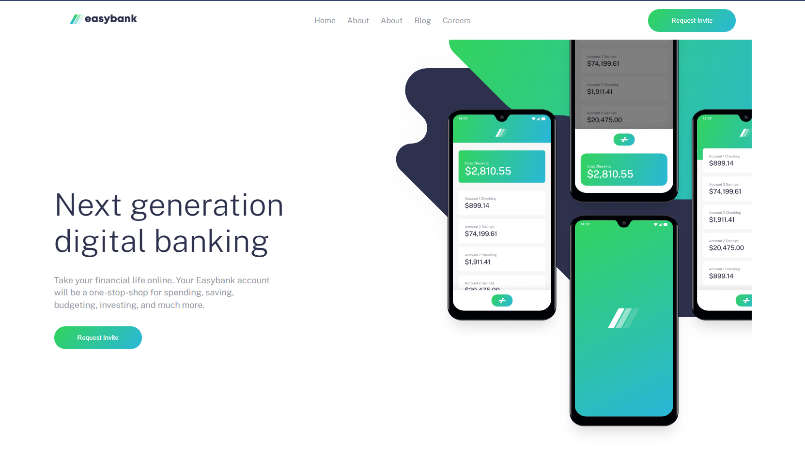

# Frontend Mentor - Easybank landing page solution

This is a solution to the [Easybank landing page challenge on Frontend Mentor](https://www.frontendmentor.io/challenges/easybank-landing-page-WaUhkoDN). Frontend Mentor challenges help you improve your coding skills by building realistic projects. 

## Table of contents

- [Overview](#overview)
  - [The challenge](#the-challenge)
  - [Screenshot](#screenshot)
  - [Links](#links)
- [My process](#my-process)
  - [Built with](#built-with)
- [Author](#author)

## Overview

### The challenge

Users should be able to:

- View the optimal layout for the site depending on their device's screen size
- See hover states for all interactive elements on the page

### Screenshot

### Links

- Solution URL: [ solution URL](https://github.com/AhmedMahim/easy-bank-frontendmentor)
- Live Site URL: [ live site URL ](https://easy-bank-frontendmentor.netlify.app/)

## My process

### Built with

- Semantic HTML5 markup
- CSS custom properties
- Flexbox
- Mobile-first workflow
- Vanilla JavaScript

## Author

- GitHub - [My Git Hub](https://github.com/AhmedMahim)
- Frontend Mentor - [@AhmedMahim](https://www.frontendmentor.io/profile/AhmedMahim)
- Twitter - [@Ahmedmahim26](https://twitter.com/Ahmedmahim26)
- LinkedIn - [@ahmed-mahim](https://www.linkedin.com/in/ahmed-mahim-741261228/)
